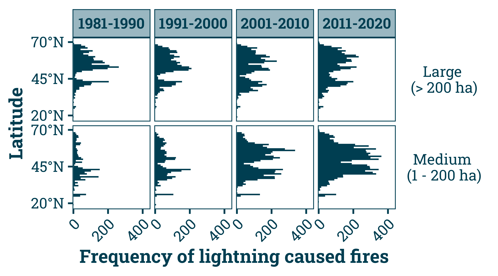
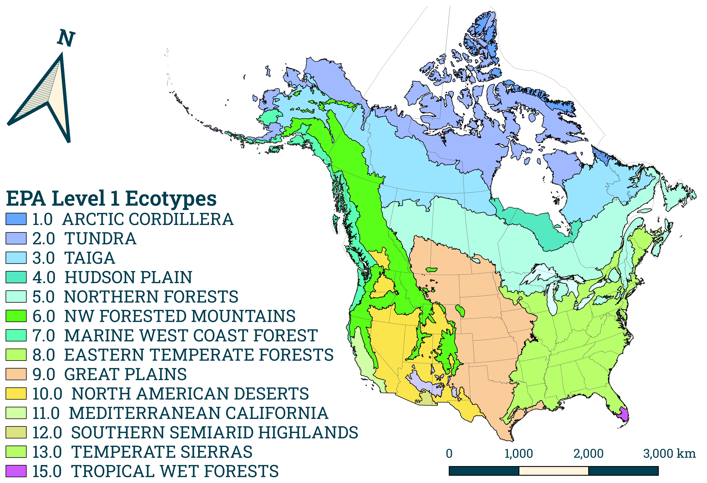
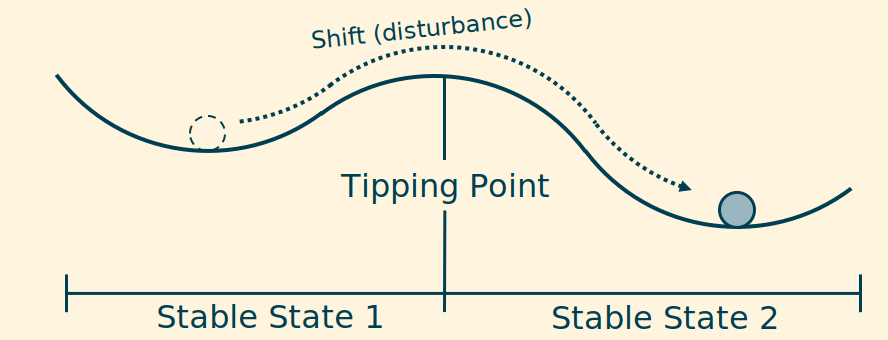

```{r, include=FALSE}
knitr::opts_chunk$set(results = 'asis',
                      echo = FALSE,
                      warning = FALSE,
                      tidy = FALSE,
                      message = FALSE,
                      fig.align = 'center',
                      out.width = "100%",
                      dev.args = list(bg = 'transparent'))
options(knitr.table.format = "html") 
```

# Introduction

Wildfire frequency, intensity, and severity have increased over the last four decades across North America (Figure 1). Ecosystem stability pre- and post-fire over a continental scale remains poorly studied. This study investigates ecosystem stability dynamics over 40 years across Canada and the US, broken up by EPA Level 1 Ecotypes (Figure 4)[@cec_ecological_1997]. As climate change continues to impact our planet, understanding these ecosystem changes is paramount to the potential prediction of future environmental and economic impacts.

{width=100%}

# Methods

NDVI data was required where fires were located on the year they burned, as well as all years before it burned and all years after it burned. NDVI from adjacent non-burned areas was also collected. All data and methods used in this project were free and openly sourced (CNFDB, USDA, GEE, QGIS, R, Python, GitHub), allowing this work to be reproduced very easily (including code to generate this poster)[@gorelick_google_2017; @canadian_forest_service_canadian_2021; @welty_combined_2021]. General steps included (Figure 2):

1. Download fire polygon data from Canada and US;
2. Extract NDVI from Landsat satellite imagery for each fire and its surrounding areas for all years between 1985 and 2020;
3. Determine ecosystem stability over 5 year chunks (inverse of the variance of NDVI in both burned and unburned areas);
4. Calculate the logged response ratio of NDVI stability, and run GAM models to determine the significance of the smoothing function (Figure 3);
5. Use LMER model to compare pre- and post-fire stabilities.

Significant trends that are noted may indicate that the ecosystems stability may have shifted causing an altered stable state (Figure 5)[@beisner_alternative_2003].

{width=100%}

# Discussion

Some ecotypes that are perturbed by fire events will eventually return to their original state, however other ecotypes appear to change their state altogether. These altered stable states can have drastic effects on the biodiversity and ecological processes that occur in these areas. Further understanding how fire may impact these regions will be crucial in the face of climate change events which will likely increase fire risk across the globe.

{width=100%}

# Future Work

Climate variables will be incorporated into these analyses to further improve our understanding of how fire can impact ecosystem stability. Additionally, fire intensity can be calculated for each fire allowing deeper classification of ecosystem stability. Similar analyses can also be completed for other spectral indices which could lend further support to the alternative stable ecosystem state hypothesis.

## Acknowledgements

<p class="references" style="margin-top: 0;">Thank you to NSERC for the funding provided through the IRC Research Grant and the NSERC Discovery Grant. Thank you to all members of the Fraser Lab for their support throughout this project.</p>

{.logo-img}

## References
